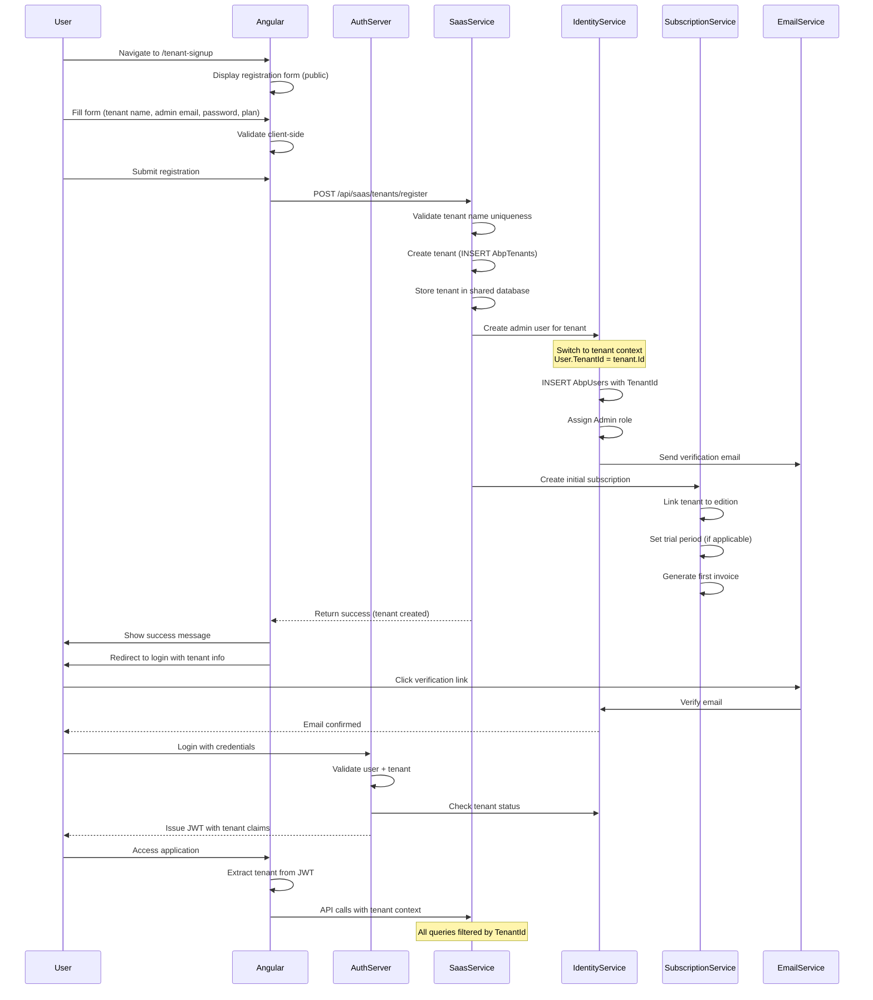
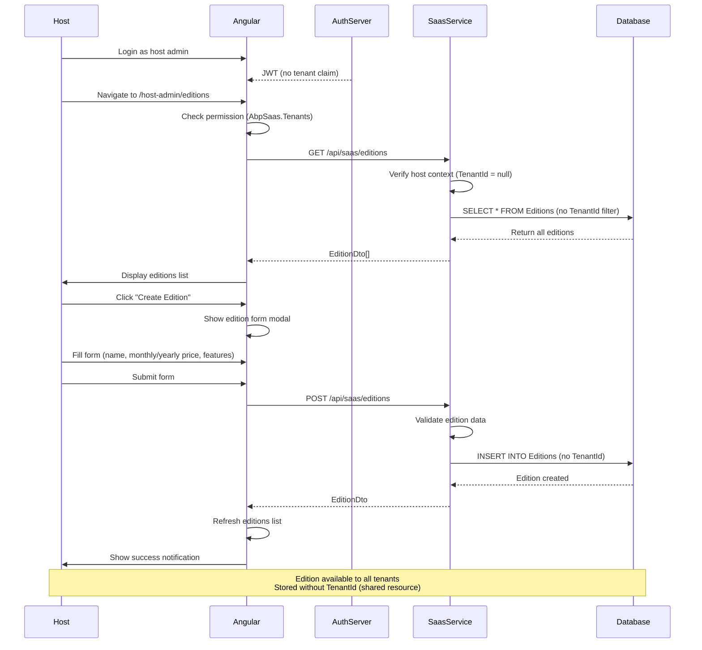
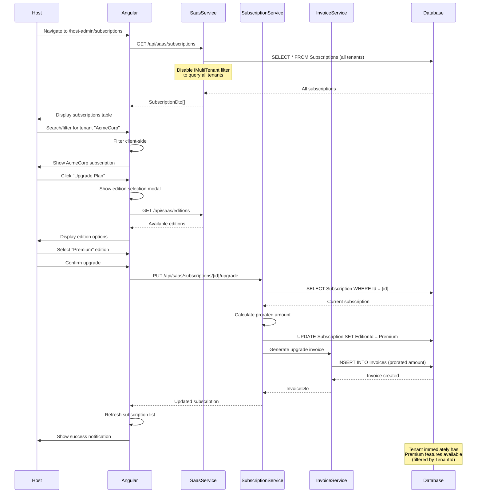
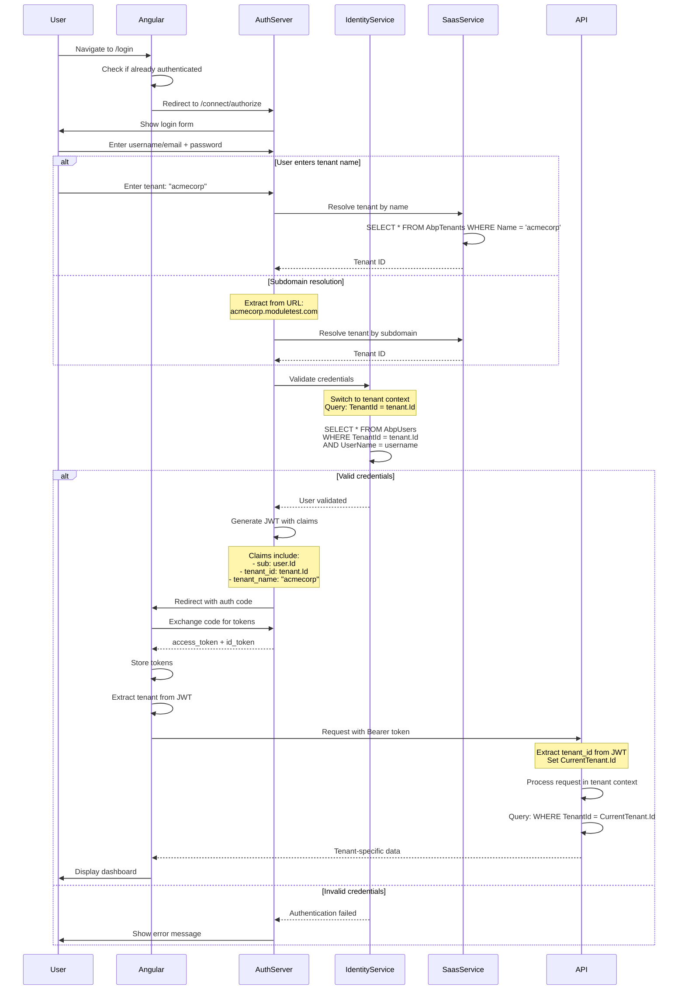
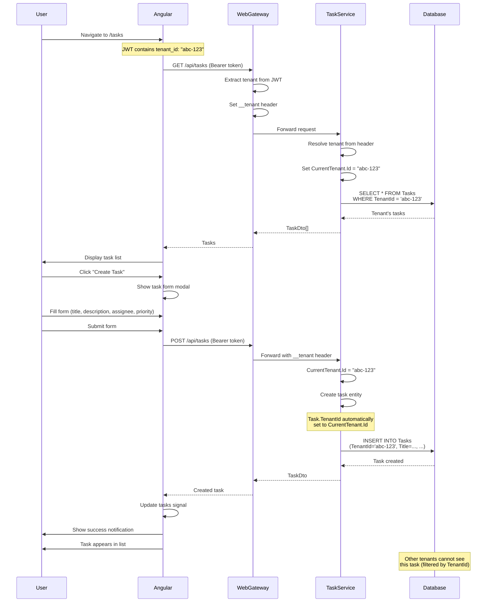
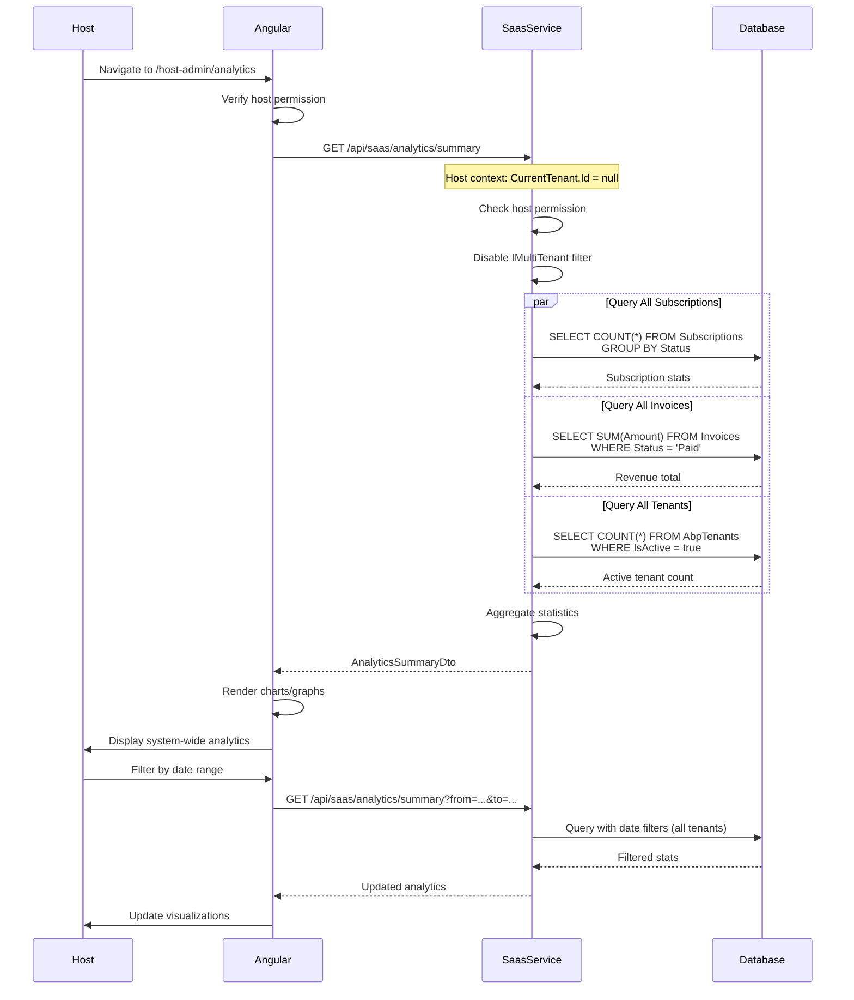
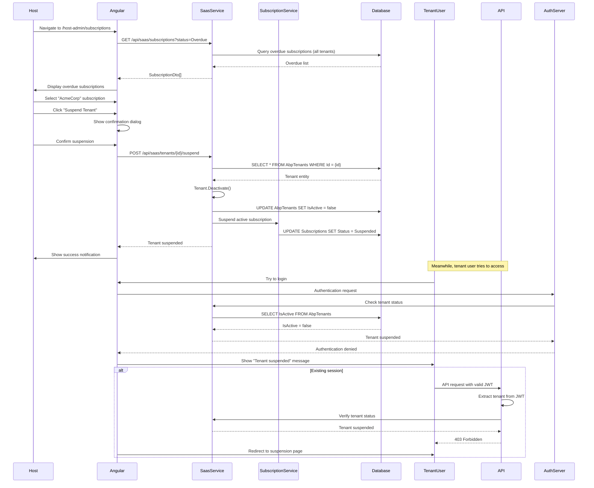

# Multi-Tenancy Architecture

## Overview

The ModuleTest application is built using **ABP Framework's Multi-Tenancy** system with a **database-per-tenant** isolation strategy. This document describes the complete multi-tenancy architecture, tenant provisioning, data isolation, and context management.

---

## 🏛️ Multi-Tenancy Strategy

### Architecture Type: **Shared Database with Tenant Filtering**

> **⚠️ Important:** This project uses **shared database architecture**, NOT database-per-tenant. The `AbpTenantConnectionStrings` table exists but is not actively used for separate tenant databases.

**Implementation Details:**

**Host Databases (Multiple Services):**
- `ModuleTest_Saas` - SaaS service with tenant metadata, subscriptions, invoices
- `ModuleTest_Identity` - Identity service with users and roles
- `ModuleTest_Administration` - Administration service
- `ModuleTest_ProductService` - Product service

**Tenant Data Storage:**
- **All tenants share the same service databases**
- Data isolation via `TenantId` column on multi-tenant entities
- Automatic query filtering by ABP Framework
- No separate databases created per tenant

**How It Works:**
```csharp
// All tenant data in same table, filtered by TenantId
Subscriptions table:
  Id | TenantId    | EditionId | Status  | ...
  1  | tenant-abc  | edition-1 | Active  | ...
  2  | tenant-xyz  | edition-2 | Active  | ...
  3  | tenant-abc  | edition-1 | Expired | ...
```

**Advantages:**
- ✅ **Simplified Infrastructure** - Single database per service
- ✅ **Easy Maintenance** - One schema to manage
- ✅ **Cost Efficient** - No per-tenant database overhead
- ✅ **Quick Tenant Provisioning** - No database creation needed
- ✅ **Efficient Backups** - Single backup per service
- ✅ **Automatic Filtering** - ABP handles tenant isolation

**Trade-offs:**
- ⚠️ **Shared Resources** - All tenants use same database server
- ⚠️ **Logical Isolation Only** - Relies on application-level filtering
- ⚠️ **Noisy Neighbor Risk** - One tenant's load affects others
- ⚠️ **Limited Customization** - Cannot customize schema per tenant

**Connection String Configuration:**
```json
// appsettings.json - All services use these
{
  "ConnectionStrings": {
    "SaasService": "Host=localhost;Database=ModuleTest_Saas;...",
    "IdentityService": "Host=localhost;Database=ModuleTest_Identity;...",
    "AdministrationService": "Host=localhost;Database=ModuleTest_Administration;...",
    "ProductService": "Host=localhost;Database=ModuleTest_ProductService;..."
  }
}
```

**Tenant Connection Strings (Optional Feature):**
The `AbpTenantConnectionStrings` table exists for future database-per-tenant support:
```csharp
// If tenant.FindDefaultConnectionString() returns value:
// → Would use separate database (not currently implemented)

// If tenant.FindDefaultConnectionString() returns null/empty:
// → Uses shared database with TenantId filtering (current behavior)
```

---

## 🔑 Core Multi-Tenancy Concepts

### 1. Tenant Context

ABP provides `ICurrentTenant` service for tenant context management:

```csharp
public class TenantAdminAppService : ApplicationService
{
    public async Task<TenantDashboardDto> GetDashboardAsync()
    {
        // Check if running in tenant context
        if (!CurrentTenant.IsAvailable)
        {
            throw new BusinessException(SaasServiceErrorCodes.TenantNotAvailable);
        }

        // Get current tenant ID
        var tenantId = CurrentTenant.Id.Value;
        var tenantName = CurrentTenant.Name;
        
        // All queries automatically filtered by tenant
        var subscription = await _subscriptionRepository
            .FindActiveByTenantIdAsync(tenantId);
    }
}
```

**Key Properties:**
- `CurrentTenant.Id` - Current tenant identifier (nullable)
- `CurrentTenant.Name` - Current tenant name
- `CurrentTenant.IsAvailable` - Whether executing in tenant context

---

### 2. Tenant Resolution

ABP automatically resolves the current tenant using multiple resolvers:

**Resolution Chain (in order):**

1. **Header Resolver** - `__tenant` HTTP header
   ```
   GET /api/subscriptions
   Headers: __tenant: {tenant-id}
   ```

2. **Subdomain Resolver** - Subdomain in URL
   ```
   https://acme-corp.moduletest.com/api/subscriptions
   ```

3. **Query String Resolver** - `tenantId` parameter
   ```
   GET /api/subscriptions?tenantId={tenant-id}
   ```

4. **Cookie Resolver** - `__tenant` cookie

5. **Claims Resolver** - JWT token claims
   ```json
   {
     "sub": "user-id",
     "tenant_id": "tenant-id"
   }
   ```

**Host Context:**
If no tenant resolved → runs in **host context** (tenant-agnostic operations)

---

### 3. Multi-Tenant Entities

Entities implementing `IMultiTenant` are automatically filtered by tenant:

```csharp
public class Subscription : FullAuditedAggregateRoot<Guid>, IMultiTenant
{
    public Guid? TenantId { get; private set; }  // Nullable for host data
    
    public Guid EditionId { get; private set; }
    public Edition Edition { get; private set; }
    // ... other properties
}
```

**Automatic Behaviors:**
- **Automatic Filtering** - Queries only return current tenant's data
- **Automatic Assignment** - `TenantId` set automatically on insert
- **Null for Host** - `TenantId` is null for host-level data

**Example:**
```csharp
// Tenant context: tenantId = "abc-123"
var subscriptions = await _subscriptionRepository.GetListAsync();
// Returns only subscriptions where TenantId = "abc-123"

// Host context: tenantId = null
var allSubscriptions = await _subscriptionRepository.GetListAsync();
// Returns all subscriptions (host data only, TenantId = null)
```

---

### 4. Tenant-Agnostic Entities

Entities **without** `IMultiTenant` are shared across all tenants:

```csharp
public class Edition : FullAuditedAggregateRoot<Guid>
{
    // No TenantId property
    public string Name { get; private set; }
    public Money MonthlyPrice { get; private set; }
    // Shared across all tenants
}
```

**Use Cases:**
- **Editions/Plans** - Same plans available to all tenants
- **System Configuration** - Global settings
- **Lookup Tables** - Country codes, currencies, etc.
- **Audit Logs** - Cross-tenant reporting

---

## 🗄️ Database Architecture

### Shared Database with Tenant Filtering Strategy

**Service Databases:**

**1. ModuleTest_Saas (SaaS Service)**
```sql
Tables:
- AbpTenants                    (Tenant metadata)
- AbpTenantConnectionStrings    (Unused - for future DB-per-tenant)
- Editions                      (Shared plans, no TenantId)
- Subscriptions                 (Multi-tenant, has TenantId)
- Invoices                      (Multi-tenant, has TenantId)
```

**2. ModuleTest_Identity (Identity Service)**
```sql
Tables:
- AbpUsers                      (Multi-tenant, has TenantId)
- AbpRoles                      (Multi-tenant, has TenantId)
- AbpUserRoles                  (Multi-tenant, filtered by user's TenantId)
- AbpUserClaims                 (Multi-tenant, filtered by user's TenantId)
```

**3. ModuleTest_Administration (Administration Service)**
```sql
Tables:
- AbpAuditLogs                  (Multi-tenant, has TenantId)
- AbpSettings                   (Multi-tenant, has TenantId)
- AbpFeatureValues              (Multi-tenant, has TenantId)
```

**4. ModuleTest_ProductService (Product Service)**
```sql
Tables:
- Products                      (Multi-tenant, has TenantId)
- Tasks                         (Multi-tenant, has TenantId)
- Custom application data       (Multi-tenant, has TenantId)
```

**Connection Strings (Shared):**

All tenants use the same connection strings:
```json
{
  "ConnectionStrings": {
    "SaasService": "Host=localhost;Database=ModuleTest_Saas;...",
    "IdentityService": "Host=localhost;Database=ModuleTest_Identity;...",
    "AdministrationService": "Host=localhost;Database=ModuleTest_Administration;...",
    "ProductService": "Host=localhost;Database=ModuleTest_ProductService;..."
  }
}
```

**Tenant Isolation Mechanism:**

```sql
-- Example: Subscriptions table (shared by all tenants)
CREATE TABLE "Subscriptions" (
    "Id" uuid PRIMARY KEY,
    "TenantId" uuid NULL,              -- ← Isolates tenant data
    "EditionId" uuid NOT NULL,
    "Status" int NOT NULL,
    "StartDate" timestamp NOT NULL,
    -- Other columns...
    
    -- Indexes for efficient tenant queries
    CREATE INDEX "IX_Subscriptions_TenantId" ON "Subscriptions" ("TenantId");
    CREATE INDEX "IX_Subscriptions_TenantId_Status" ON "Subscriptions" ("TenantId", "Status");
);

-- Data looks like:
-- TenantId             | EditionId | Status | ...
-- tenant-abc-123       | edition-1 | Active | ...  ← Tenant A's data
-- tenant-xyz-456       | edition-2 | Active | ...  ← Tenant B's data
-- tenant-abc-123       | edition-1 | Expired| ...  ← Tenant A's data
```

**Query Filtering:**

```csharp
// When tenant-abc-123 is logged in:
var subscriptions = await _subscriptionRepository.GetListAsync();

// Generated SQL (automatic filtering by ABP):
// SELECT * FROM "Subscriptions" WHERE "TenantId" = 'tenant-abc-123'

// Tenant B cannot see Tenant A's data
// Filtering happens at application level via ABP's IMultiTenant interface
```

---

## 🔄 Workflow Design

### 1. Tenant Self-Service Registration Flow

**User Journey: Public Tenant Signup**



**Key Steps:**
1. ✅ **Public Access** - No authentication required for signup
2. ✅ **Tenant Creation** - Insert into shared database with unique ID
3. ✅ **Admin User Setup** - Create first user in tenant context
4. ✅ **Subscription Setup** - Link to selected edition/plan
5. ✅ **Email Verification** - Confirm admin email
6. ✅ **Login** - JWT includes tenant ID in claims
7. ✅ **Data Isolation** - All subsequent API calls filtered by tenant

---

### 2. Host Edition Management Flow

**User Journey: Host Creates/Manages Subscription Plans**



**Key Steps:**
1. ✅ **Host Authentication** - JWT without tenant claim
2. ✅ **Permission Check** - Requires `AbpSaas.Tenants` policy
3. ✅ **Host Context** - Queries without tenant filtering
4. ✅ **Shared Resource** - Editions have no TenantId
5. ✅ **Global Availability** - All tenants can subscribe

---

### 3. Tenant Subscription Management Flow

**User Journey: Host Upgrades Tenant Subscription**



**Key Steps:**
1. ✅ **Cross-Tenant Query** - Host sees all subscriptions
2. ✅ **Edition Change** - Update subscription record
3. ✅ **Prorated Billing** - Calculate upgrade charges
4. ✅ **Immediate Effect** - Features available instantly
5. ✅ **Invoice Generation** - Track billing changes

---

### 4. Tenant User Authentication Flow

**User Journey: Tenant User Login with Multi-Tenancy**



**Key Steps:**
1. ✅ **Tenant Resolution** - From name, subdomain, or URL
2. ✅ **Context Switch** - Identity service queries tenant users only
3. ✅ **JWT Claims** - Token includes tenant information
4. ✅ **Automatic Filtering** - All API calls filtered by tenant
5. ✅ **Data Isolation** - User sees only their tenant's data

---

### 5. Task Management with Multi-Tenancy Flow

**User Journey: Tenant User Creates and Manages Tasks**



**Key Steps:**
1. ✅ **JWT Authentication** - Token contains tenant ID
2. ✅ **Gateway Forwarding** - Tenant header propagated
3. ✅ **Automatic Context** - Service sets CurrentTenant
4. ✅ **Query Filtering** - Only tenant's tasks returned
5. ✅ **Automatic Assignment** - TenantId set on insert
6. ✅ **Data Isolation** - Other tenants excluded

---

### 6. Cross-Tenant Reporting Flow (Host Only)

**User Journey: Host Generates System-Wide Analytics**



**Key Steps:**
1. ✅ **Host Context** - No tenant filtering
2. ✅ **Disable Filter** - Explicitly disable `IMultiTenant`
3. ✅ **Cross-Tenant Queries** - Aggregate all tenant data
4. ✅ **Permission Check** - Only host admins allowed
5. ✅ **Parallel Queries** - Efficient data gathering

---

### 7. Tenant Deactivation/Suspension Flow

**User Journey: Host Suspends Tenant for Non-Payment**



**Key Steps:**
1. ✅ **Overdue Detection** - Query subscriptions by status
2. ✅ **Tenant Deactivation** - Set IsActive = false
3. ✅ **Subscription Suspension** - Update status
4. ✅ **Login Blocked** - Prevent new sessions
5. ✅ **API Blocked** - Reject existing sessions
6. ✅ **User Notification** - Display suspension message

---

## 🔄 Tenant Provisioning Process

### Complete Tenant Onboarding Flow

The `TenantProvisioningManager` orchestrates the entire process:

```csharp
public class TenantProvisioningManager : DomainService
{
    [UnitOfWork]
    public virtual async Task<TenantProvisioningResult> ProvisionTenantAsync(
        string tenantName,
        Guid editionId,
        BillingPeriod billingPeriod,
        string adminEmail,
        string adminUserName,
        string adminPassword,
        int? trialDays = null)
    {
        // 1. Validate edition
        var edition = await _editionRepository.GetAsync(editionId);
        if (!edition.IsActive)
            throw new BusinessException("Edition not active");

        // 2. Create tenant in ABP system (host context)
        var tenant = await _tenantManager.CreateAsync(tenantName);
        
        // 3. Create admin user in tenant context
        using (CurrentTenant.Change(tenant.Id))
        {
            var adminUser = await CreateTenantAdminUserAsync(
                adminUserName, adminEmail, adminPassword, tenant.Id
            );
        }

        // 4. Create subscription (host context)
        var subscription = await _subscriptionManager.CreateSubscriptionAsync(
            tenant.Id, editionId, billingPeriod, trialDays: trialDays
        );

        // 5. Generate initial invoice
        var invoice = await _invoiceManager.GenerateInvoiceAsync(subscription);

        // 6. Raise domain event
        AddDistributedEvent(new TenantProvisionedEvent(
            tenant.Id, tenant.Name, subscription.Id, edition.Id
        ));

        return new TenantProvisioningResult
        {
            Tenant = tenant,
            Subscription = subscription,
            InitialInvoice = invoice
        };
    }
}
```

**Provisioning Steps:**

1. **Validate Edition** ✅
   - Check edition exists and is active
   - Load pricing and feature limits

2. **Create Tenant** ✅
   - Insert into `AbpTenants` table
   - Generate unique tenant ID
   - Create database connection string

3. **Create Admin User** ✅
   - Switch to tenant context
   - Create admin user in tenant's database
   - Assign admin role

4. **Create Subscription** ✅
   - Link tenant to edition
   - Set billing period and price
   - Configure trial period if applicable

5. **Generate Invoice** ✅
   - Create first invoice for subscription
   - Set due date based on billing period
   - Calculate amount from edition price

6. **Raise Events** ✅
   - Notify other services
   - Trigger welcome email
   - Initialize tenant data

---

## 🎯 Data Isolation Patterns

### 1. Entity Configuration

```csharp
public static void ConfigureSaaS(this ModelBuilder builder)
{
    builder.Entity<Subscription>(b =>
    {
        b.ToTable("Subscriptions");
        
        // Configure multi-tenancy
        b.ConfigureByConvention();  // Applies IMultiTenant conventions
        
        // Index for tenant queries
        b.HasIndex(s => s.TenantId);
        
        // Composite index for common queries
        b.HasIndex(s => new { s.TenantId, s.Status });
    });

    builder.Entity<Invoice>(b =>
    {
        b.ToTable("Invoices");
        b.ConfigureByConvention();  // Auto-applies tenant filtering
        
        b.HasIndex(i => i.TenantId);
        b.HasIndex(i => new { i.TenantId, i.Status });
    });

    builder.Entity<Edition>(b =>
    {
        b.ToTable("Editions");
        // No IMultiTenant - shared across tenants
        // No TenantId property or index
    });
}
```

**ABP Conventions Applied by `ConfigureByConvention()`:**
- Adds `TenantId` column with index
- Configures global query filter for automatic tenant filtering
- Sets up audit properties (CreatorId, CreationTime, etc.)
- Configures soft delete (IsDeleted)

---

### 2. Query Filtering

**Automatic Filtering (ABP Magic):**

```csharp
// In tenant context (TenantId = "abc-123")
var subscriptions = await _subscriptionRepository.GetListAsync();

// Generated SQL:
// SELECT * FROM Subscriptions WHERE TenantId = 'abc-123'
```

**Explicit Filtering:**

```csharp
public interface ISubscriptionRepository : IRepository<Subscription, Guid>
{
    Task<Subscription> FindActiveByTenantIdAsync(Guid tenantId);
}

public class SubscriptionRepository : EfCoreRepository<SaasServiceDbContext, Subscription, Guid>, 
    ISubscriptionRepository
{
    public async Task<Subscription> FindActiveByTenantIdAsync(Guid tenantId)
    {
        var query = await GetQueryableAsync();
        return await query
            .Where(s => s.TenantId == tenantId)  // Explicit tenant filter
            .Where(s => s.Status == SubscriptionStatus.Active)
            .FirstOrDefaultAsync();
    }
}
```

**Host Context Queries:**

```csharp
// Disable tenant filter to query all tenants (host only)
using (_dataFilter.Disable<IMultiTenant>())
{
    var allSubscriptions = await _subscriptionRepository.GetListAsync();
    // Returns subscriptions from ALL tenants
}
```

---

### 3. Cross-Tenant Operations

**Switching Tenant Context:**

```csharp
public class TenantProvisioningManager : DomainService
{
    public async Task ProvisionTenantAsync(...)
    {
        // Currently in HOST context
        var tenant = await _tenantManager.CreateAsync(tenantName);
        
        // Switch to TENANT context
        using (CurrentTenant.Change(tenant.Id))
        {
            // Now operating in tenant's context
            // All multi-tenant entities filtered by tenant.Id
            var adminUser = await _userManager.CreateAsync(user, password);
            
            // User automatically assigned to tenant.Id
        }
        
        // Back to HOST context
        var subscription = await _subscriptionManager.CreateSubscriptionAsync(
            tenant.Id, editionId, billingPeriod
        );
    }
}
```

**Change Context Methods:**
- `CurrentTenant.Change(tenantId)` - Switch to specific tenant
- `CurrentTenant.Change(null)` - Switch to host context

---

## 🔐 Security & Access Control

### 1. Tenant Isolation Guarantees

**Database Level:**
- ⚠️ **Logical isolation only** - All tenants in same database
- Physical separation at table row level via `TenantId` column
- Relies on application-level filtering (no database-enforced isolation)
- **Risk:** Programming error could expose cross-tenant data

**Application Level:**
- ✅ **Automatic query filtering** via `IMultiTenant` interface
- ✅ **Global EF Core filters** applied to all queries
- ✅ **Explicit checks** in application services
- ✅ **ABP Framework** handles tenant context automatically

**Code-Level Protection:**

```csharp
// EF Core automatically adds TenantId filter to all queries
protected override void OnModelCreating(ModelBuilder builder)
{
    builder.Entity<Subscription>(b =>
    {
        b.ConfigureByConvention(); // Adds global query filter
        
        // Equivalent to:
        b.HasQueryFilter(e => 
            e.TenantId == null || 
            e.TenantId == CurrentTenant.Id
        );
    });
}
```

**API Level:**
- Tenant resolution from JWT token claims
- Authorization policies enforce tenant membership
- Cross-tenant API requests automatically filtered
- Middleware validates tenant context on each request

**Security Considerations:**
- ⚠️ **No physical isolation** - SQL injection could bypass filters
- ⚠️ **Application dependency** - Security relies on correct code
- ✅ **Multiple layers** - Defense in depth with context checks
- ✅ **Audit logging** - All operations logged with TenantId

---

### 2. Host vs Tenant Operations

**Host Operations (TenantId = null):**
```csharp
public class EditionAppService : ApplicationService
{
    public async Task<EditionDto> CreateAsync(CreateEditionDto input)
    {
        // Always runs in HOST context
        // Editions are tenant-agnostic (no IMultiTenant)
        var edition = new Edition(...);
        await _editionRepository.InsertAsync(edition);
        // Edition.TenantId remains null (shared resource)
    }
}
```

**Tenant Operations (TenantId = current tenant):**
```csharp
public class SubscriptionAppService : ApplicationService
{
    public async Task<SubscriptionDto> GetCurrentTenantSubscriptionAsync()
    {
        // Runs in TENANT context
        // CurrentTenant.Id automatically resolved
        
        var tenantId = CurrentTenant.Id.Value;
        var subscription = await _subscriptionRepository
            .FindActiveByTenantIdAsync(tenantId);
        
        // Subscription.TenantId = CurrentTenant.Id
        return ObjectMapper.Map<Subscription, SubscriptionDto>(subscription);
    }
}
```

**Mixed Operations:**
```csharp
public class HostAdminAppService : ApplicationService
{
    public async Task<List<TenantDto>> GetTenantsWithSubscriptionsAsync()
    {
        // Running in HOST context (multi-tenant admin)
        
        // Disable tenant filter to query all tenants
        using (_dataFilter.Disable<IMultiTenant>())
        {
            var subscriptions = await _subscriptionRepository.GetListAsync();
            // Returns subscriptions for ALL tenants
            
            var tenantIds = subscriptions.Select(s => s.TenantId).Distinct();
            // Can aggregate cross-tenant data
        }
    }
}
```

---

## 📊 Database Schema Comparison

### Host Database (ModuleTest_Saas)

**Tenant Management:**
```sql
-- Stores tenant metadata (managed by ABP)
CREATE TABLE "AbpTenants" (
    "Id" uuid PRIMARY KEY,
    "Name" varchar(64) NOT NULL,
    "NormalizedName" varchar(64) NOT NULL,
    "ConcurrencyStamp" varchar(40),
    -- Audit columns
);

-- Stores tenant database connections
CREATE TABLE "AbpTenantConnectionStrings" (
    "TenantId" uuid NOT NULL,
    "Name" varchar(64) NOT NULL,
    "Value" text NOT NULL,
    PRIMARY KEY ("TenantId", "Name")
);
```

**Shared Resources:**
```sql
-- Editions are shared (no TenantId)
CREATE TABLE "Editions" (
    "Id" uuid PRIMARY KEY,
    "Name" varchar(128) NOT NULL,
    "MonthlyPrice" decimal(18,2) NOT NULL,
    "YearlyPrice" decimal(18,2) NOT NULL,
    -- No TenantId column
);
```

**Multi-Tenant Data:**
```sql
-- Subscriptions are tenant-specific
CREATE TABLE "Subscriptions" (
    "Id" uuid PRIMARY KEY,
    "TenantId" uuid NULL,  -- Links to tenant
    "EditionId" uuid NOT NULL,
    "BillingPeriod" int NOT NULL,
    "Status" int NOT NULL,
    -- Audit columns
    INDEX "IX_Subscriptions_TenantId" ("TenantId"),
    INDEX "IX_Subscriptions_TenantId_Status" ("TenantId", "Status")
);

-- Invoices are tenant-specific
CREATE TABLE "Invoices" (
    "Id" uuid PRIMARY KEY,
    "TenantId" uuid NULL,  -- Links to tenant
    "SubscriptionId" uuid NOT NULL,
    "InvoiceNumber" varchar(50) NOT NULL,
    "Status" int NOT NULL,
    -- Audit columns
    INDEX "IX_Invoices_TenantId" ("TenantId")
);
```

---

### Tenant Database (ModuleTest_AcmeCorp)

**Identity Data:**
```sql
-- Users belong to this tenant only
CREATE TABLE "AbpUsers" (
    "Id" uuid PRIMARY KEY,
    "TenantId" uuid NULL,  -- References this tenant
    "UserName" varchar(256) NOT NULL,
    "Email" varchar(256),
    -- Identity columns
);

CREATE TABLE "AbpRoles" (
    "Id" uuid PRIMARY KEY,
    "TenantId" uuid NULL,
    "Name" varchar(256) NOT NULL,
    -- Role columns
);
```

**Application Data:**
```sql
-- Products owned by tenant
CREATE TABLE "Products" (
    "Id" uuid PRIMARY KEY,
    "TenantId" uuid NULL,
    "Name" varchar(256) NOT NULL,
    "Price" decimal(18,2),
    -- Product columns
);

-- Tasks owned by tenant
CREATE TABLE "Tasks" (
    "Id" uuid PRIMARY KEY,
    "TenantId" uuid NULL,
    "Title" varchar(500) NOT NULL,
    "Status" int NOT NULL,
    -- Task columns
);
```

---

## 🔄 Tenant Lifecycle Management

### 1. Tenant Creation (Shared Database)

```csharp
// 1. Create tenant entity in AbpTenants table
var tenant = await _tenantManager.CreateAsync("AcmeCorp");

// 2. Connection string is NOT set (uses shared database)
// AbpTenantConnectionStrings table remains empty for this tenant
// Tenant will use the same database, isolated by TenantId column

// 3. NO separate database migration needed
// Tenant uses existing service databases

// 4. Seed initial tenant-specific data
using (CurrentTenant.Change(tenant.Id))
{
    // Create admin user in Identity database
    await _userManager.CreateAsync(adminUser, password);
    
    // All data automatically gets TenantId = tenant.Id
    // No separate database created
}
```

**What Actually Happens:**

```sql
-- 1. Insert into AbpTenants (in ModuleTest_Saas database)
INSERT INTO "AbpTenants" ("Id", "Name", ...) 
VALUES ('abc-123', 'AcmeCorp', ...);

-- 2. Create admin user (in ModuleTest_Identity database)
-- User.TenantId automatically set to 'abc-123'
INSERT INTO "AbpUsers" ("Id", "TenantId", "UserName", ...) 
VALUES ('user-id', 'abc-123', 'admin', ...);

-- 3. No database creation
-- No connection string in AbpTenantConnectionStrings
-- All queries filtered by TenantId
```

---

### 2. Tenant Activation/Deactivation

```csharp
public class HostAdminAppService : ApplicationService
{
    public async Task ActivateTenantAsync(Guid tenantId)
    {
        var tenant = await _tenantRepository.GetAsync(tenantId);
        
        // Enable tenant
        tenant.Activate();  // ABP built-in
        
        await _tenantRepository.UpdateAsync(tenant);
        
        // Reactivate subscription
        var subscription = await _subscriptionRepository
            .FindActiveByTenantIdAsync(tenantId);
        subscription?.Activate();
    }

    public async Task DeactivateTenantAsync(Guid tenantId)
    {
        var tenant = await _tenantRepository.GetAsync(tenantId);
        
        // Disable tenant (blocks access)
        tenant.Deactivate();  // ABP built-in
        
        await _tenantRepository.UpdateAsync(tenant);
    }
}
```

---

### 3. Tenant Deletion

```csharp
public async Task DeleteTenantAsync(Guid tenantId)
{
    // 1. Cancel active subscription
    var subscription = await _subscriptionRepository
        .FindActiveByTenantIdAsync(tenantId);
    subscription?.Cancel();

    // 2. Soft delete tenant (ABP handles this)
    await _tenantRepository.DeleteAsync(tenantId);
    
    // 3. Schedule database cleanup (manual job)
    await _backgroundJobManager.EnqueueAsync(
        new DeleteTenantDatabaseArgs { TenantId = tenantId }
    );
}
```

---

## 🎨 Multi-Tenancy Patterns Applied

### 1. Context Switching Pattern

Used when host needs to perform operations in tenant context:

```csharp
using (CurrentTenant.Change(targetTenantId))
{
    // All operations now scoped to targetTenantId
    var data = await _repository.GetListAsync();
}
// Back to original context
```

---

### 2. Tenant Resolver Pattern

Chain of responsibility for tenant identification:

```
HTTP Request
    ↓
Header Resolver → Subdomain Resolver → Query Resolver → Cookie Resolver → Claims Resolver
    ↓
CurrentTenant.Id = resolved-tenant-id
```

---

### 3. Data Filter Pattern

Automatic query filtering based on tenant context:

```csharp
// Enabled by default for IMultiTenant entities
var data = await _repository.GetListAsync();
// Automatically filtered by CurrentTenant.Id

// Disable filter when needed (host only)
using (_dataFilter.Disable<IMultiTenant>())
{
    var allData = await _repository.GetListAsync();
}
```

---

### 4. Connection String Resolution Pattern

Shared database connection based on service:

```csharp
// ABP resolves connection string per service (not per tenant)
var connectionString = await _connectionStringResolver
    .ResolveAsync<SaasServiceDbContext>(CurrentTenant.Id);

// Always returns same connection string for all tenants:
// "Host=localhost;Database=ModuleTest_Saas;..."

// Tenant isolation happens via TenantId filtering, not separate databases
```

**DbMigrator Behavior:**

```csharp
// ModuleTestDbMigrationService.cs
foreach (var tenant in tenants)
{
    var connectionString = tenant.FindDefaultConnectionString();
    
    if (connectionString.IsNullOrWhiteSpace())
    {
        // NULL/EMPTY → Uses shared database (current behavior)
        // Just switches tenant context, same DB
        using (_currentTenant.Change(tenant.Id))
        {
            // Migrations already applied to shared database
            // No tenant-specific migrations needed
        }
    }
    else
    {
        // HAS VALUE → Would create separate database
        // NOT CURRENTLY USED in this project
        await MigrateTenantDatabaseAsync(tenant, connectionString);
    }
}
```

---

## 📋 Best Practices

### ✅ DO

1. **Always check tenant context** before operations:
   ```csharp
   if (!CurrentTenant.IsAvailable)
       throw new BusinessException("Tenant context required");
   ```

2. **Use `IMultiTenant`** for tenant-specific entities:
   ```csharp
   public class MyEntity : FullAuditedAggregateRoot<Guid>, IMultiTenant
   ```

3. **Index `TenantId` columns** for performance:
   ```csharp
   b.HasIndex(e => e.TenantId);
   b.HasIndex(e => new { e.TenantId, e.Status });
   ```

4. **Use explicit repositories** for complex queries:
   ```csharp
   public interface IMyRepository : IRepository<MyEntity, Guid>
   {
       Task<MyEntity> FindByTenantAsync(Guid tenantId);
   }
   ```

5. **Test cross-tenant isolation** thoroughly

---

### ❌ DON'T

1. **Don't hard-code tenant IDs** in code:
   ```csharp
   // Bad
   var tenantId = new Guid("abc-123");
   
   // Good
   var tenantId = CurrentTenant.Id.Value;
   ```

2. **Don't bypass tenant filters** without authorization:
   ```csharp
   // Dangerous - requires host admin permission
   using (_dataFilter.Disable<IMultiTenant>())
   {
       // Cross-tenant query
   }
   ```

3. **Don't expose tenant IDs** in public APIs:
   ```csharp
   // Bad - tenant ID in URL
   [HttpGet("tenants/{tenantId}/data")]
   
   // Good - use current tenant context
   [HttpGet("data")]
   ```

4. **Don't share sensitive data** across tenants:
   - Encryption keys
   - API credentials
   - Business logic that could leak data

5. **Don't create tenant-specific code** - use configuration:
   ```csharp
   // Bad - tenant-specific logic
   if (CurrentTenant.Name == "AcmeCorp")
       return specialBehavior();
   
   // Good - feature flags or tenant settings
   if (await _featureChecker.IsEnabledAsync("SpecialFeature"))
       return specialBehavior();
   ```

---

## 🧪 Testing Multi-Tenancy

### Unit Tests

```csharp
public class SubscriptionAppService_Tests : SaasServiceApplicationTestBase
{
    [Fact]
    public async Task Should_Get_Only_Current_Tenant_Subscriptions()
    {
        // Arrange
        var tenant1Id = Guid.NewGuid();
        var tenant2Id = Guid.NewGuid();
        
        // Act - Create in tenant 1 context
        using (ChangeCurrentTenant(tenant1Id))
        {
            await _subscriptionAppService.CreateAsync(new CreateSubscriptionDto {...});
        }
        
        // Act - Query in tenant 2 context
        using (ChangeCurrentTenant(tenant2Id))
        {
            var subscriptions = await _subscriptionAppService.GetListAsync();
            
            // Assert - Should not see tenant 1 data
            subscriptions.Items.ShouldBeEmpty();
        }
    }
}
```

---

### Integration Tests

```csharp
public class MultiTenant_Integration_Tests : SaasServiceTestBase
{
    [Fact]
    public async Task Should_Provision_Complete_Tenant()
    {
        // Arrange
        var request = new TenantProvisioningRequestDto
        {
            TenantName = "TestCorp",
            EditionId = _freeEditionId,
            BillingPeriod = BillingPeriod.Monthly,
            AdminEmail = "admin@testcorp.com"
        };
        
        // Act
        var result = await _provisioningService.ProvisionAsync(request);
        
        // Assert
        result.Success.ShouldBeTrue();
        result.TenantId.ShouldNotBe(Guid.Empty);
        
        // Verify tenant can access their data
        using (ChangeCurrentTenant(result.TenantId))
        {
            var subscription = await _subscriptionRepository
                .FindActiveByTenantIdAsync(result.TenantId.Value);
            
            subscription.ShouldNotBeNull();
            subscription.EditionId.ShouldBe(_freeEditionId);
        }
    }
}
```

---

## 🔍 Troubleshooting

### Common Issues

**1. "No tenant context available"**
```
Solution: Ensure tenant is resolved via header, subdomain, or JWT token
Check: CurrentTenant.IsAvailable before operations
```

**2. "Cross-tenant data leak"**
```
Solution: Verify IMultiTenant implementation on entities
Check: Query filters are not disabled unintentionally
Test: Isolation with integration tests
```

**3. "Connection string not found"**
```
Note: This should NOT occur with shared database architecture
All tenants use service-level connection strings
AbpTenantConnectionStrings table is unused in current implementation
If error occurs: Check service configuration in appsettings.json
```

**4. "User cannot access tenant"**
```
Solution: Verify user is created within tenant context
Check: User.TenantId matches CurrentTenant.Id
Verify: JWT token contains correct tenant claim
```

---

## 📊 Monitoring & Metrics

**Key Metrics to Track:**
- Active tenant count
- Tenant database sizes
- Query performance per tenant
- Cross-tenant query count (should be minimal)
- Failed tenant provisioning attempts
- Connection pool utilization

**Logging Tenant Context:**
```csharp
Logger.LogInformation(
    "Processing request for Tenant: {TenantId} ({TenantName})",
    CurrentTenant.Id,
    CurrentTenant.Name
);
```

---

## 📚 References

- ABP Multi-Tenancy Documentation: https://abp.io/docs/latest/framework/architecture/multi-tenancy
- ABP Tenant Management: https://abp.io/docs/latest/modules/tenant-management
- Database Per Tenant Strategy: https://abp.io/docs/latest/framework/architecture/multi-tenancy/database-per-tenant
- ABP Data Filtering: https://abp.io/docs/latest/framework/infrastructure/data-filtering

---

## 🎯 Summary

The ModuleTest application implements **shared database with tenant filtering** multi-tenancy:

**Architecture:**
- ✅ **Shared Databases** - One database per microservice (not per tenant)
- ✅ **Logical Isolation** - TenantId column filters data per tenant
- ✅ **Automatic Filtering** - `IMultiTenant` entities auto-filtered by ABP
- ✅ **Context Management** - `CurrentTenant` service for context control
- ✅ **Tenant Provisioning** - Complete onboarding with subscription & billing
- ✅ **Cost Efficient** - No per-tenant database overhead
- ✅ **Quick Provisioning** - Instant tenant creation, no DB setup needed

**Service Databases:**
- `ModuleTest_Saas` - Tenant metadata, editions, subscriptions, invoices
- `ModuleTest_Identity` - Users and roles (multi-tenant)
- `ModuleTest_Administration` - Settings and audit logs (multi-tenant)
- `ModuleTest_ProductService` - Application data (multi-tenant)

**Isolation Mechanism:**
- Application-level filtering via ABP Framework
- EF Core global query filters on `TenantId`
- No physical database separation
- Suitable for most SaaS applications without strict compliance requirements

**Future Extensibility:**
The `AbpTenantConnectionStrings` table exists for potential database-per-tenant upgrade if needed for enterprise customers with strict data residency requirements.
