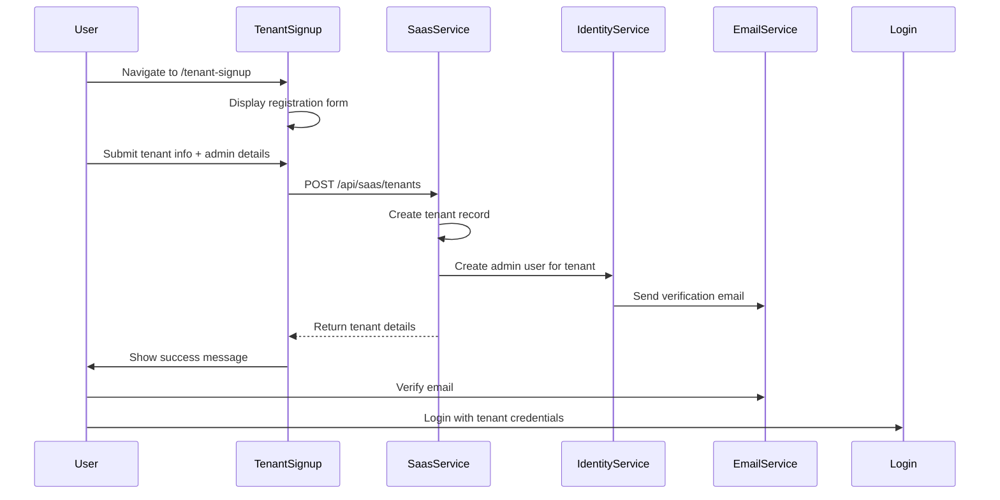
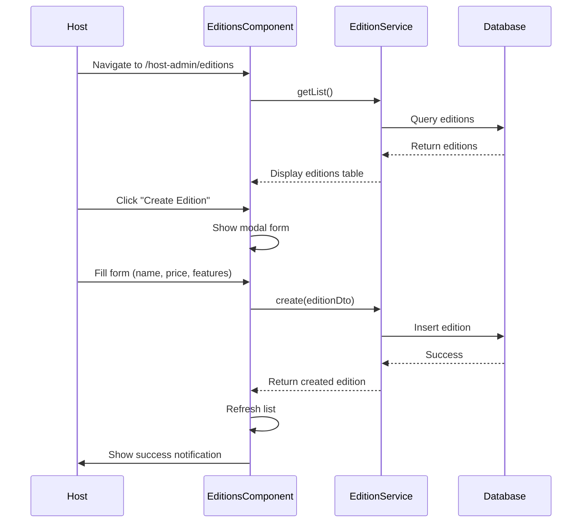
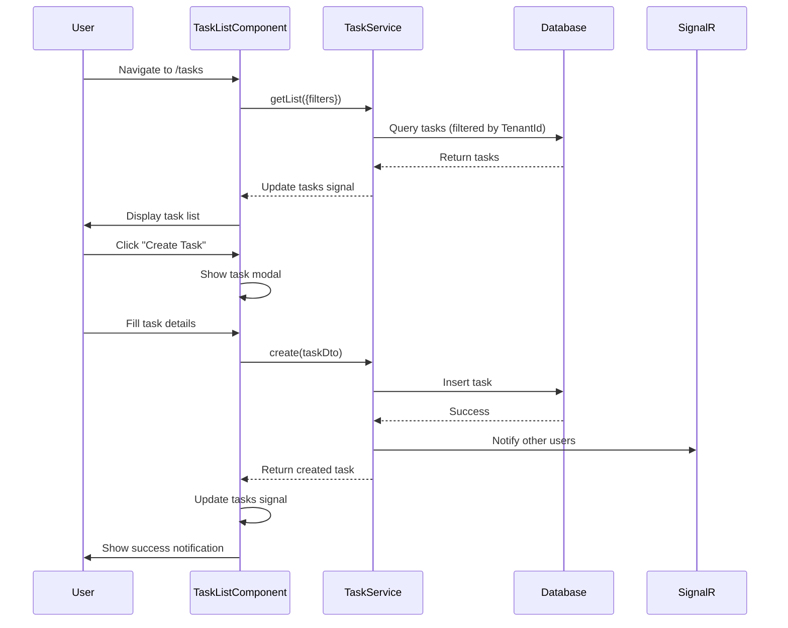
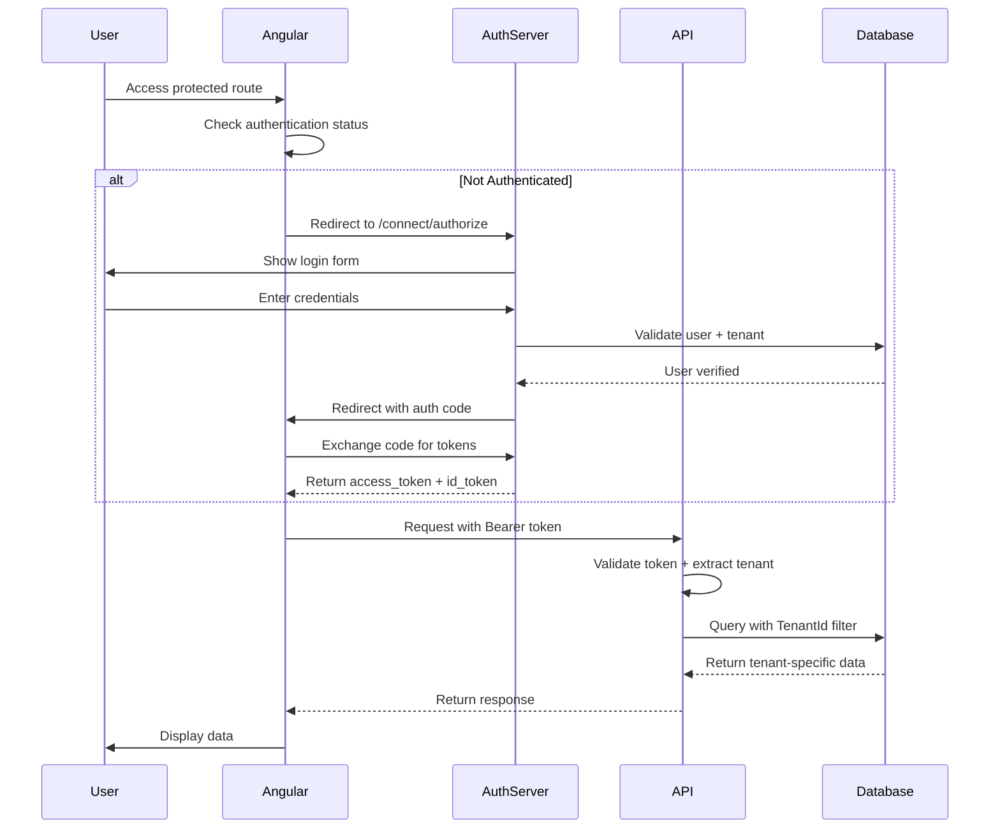
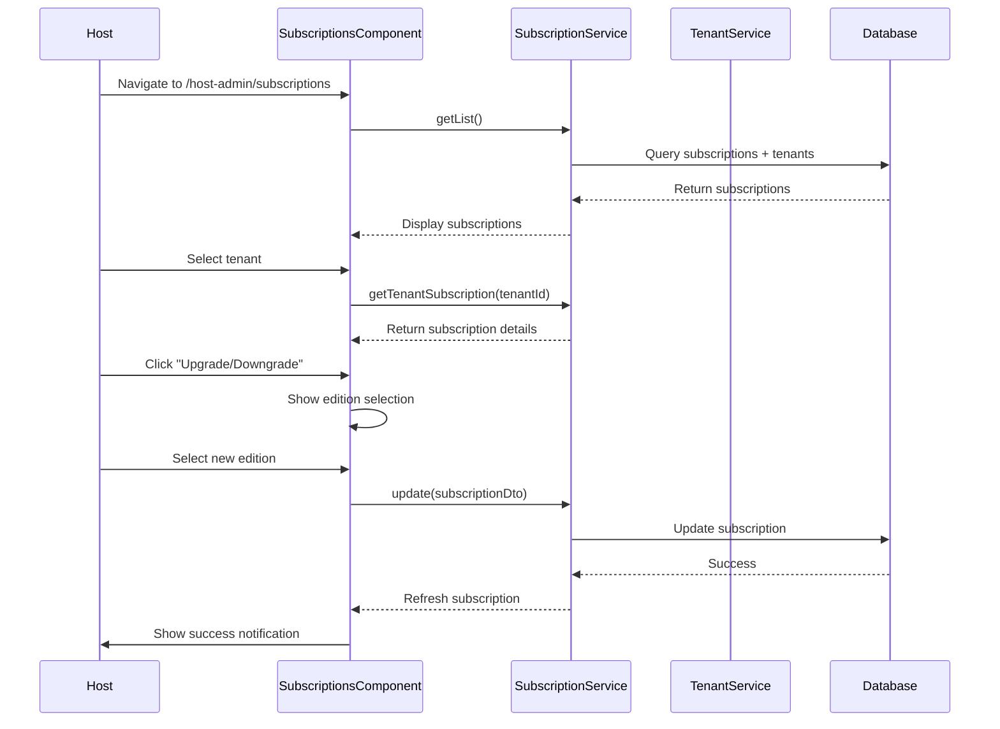

# Angular UI Component Structure Architecture

## Table of Contents
1. [Overview](#overview)
2. [Project Structure](#project-structure)
3. [Application Architecture](#application-architecture)
4. [Component Patterns](#component-patterns)
5. [Module Organization](#module-organization)
6. [Routing Architecture](#routing-architecture)
7. [State Management](#state-management)
8. [Service Layer](#service-layer)
9. [ABP Framework Integration](#abp-framework-integration)
10. [Best Practices](#best-practices)

---

## Overview

The Angular application is built using **Angular 20** with **ABP Framework 9.3** (Commercial), following modern Angular patterns with **standalone components** and **signals-based reactivity**. The architecture implements a **modular microservices UI** structure that mirrors the backend microservices architecture.

### Key Technologies
- **Angular 20**: Latest Angular with signal-based state management
- **ABP Framework 9.3**: Commercial framework providing enterprise features
- **Lepton X Theme**: Commercial UI theme with pre-built components
- **RxJS 7.8**: Reactive programming for async operations
- **TypeScript 5.8**: Strict type safety and modern features
- **SCSS**: Styling with Bootstrap 5 integration

### Architecture Principles
1. **Standalone Components**: Modern Angular architecture without NgModules (except legacy modules)
2. **Lazy Loading**: Route-based code splitting for optimal performance
3. **Dependency Injection**: Provider-based configuration for services
4. **Reactive Patterns**: RxJS observables and Angular signals
5. **Multi-Tenancy Aware**: Tenant-specific UI rendering and context management

---

## Project Structure

### Workspace Layout

```
apps/angular/
├── angular.json                    # Angular CLI configuration
├── package.json                    # Dependencies and scripts
├── tsconfig.json                   # TypeScript configuration
├── projects/
│   ├── module-test/               # Main application
│   │   ├── src/
│   │   │   ├── app/
│   │   │   │   ├── app.component.ts          # Root component
│   │   │   │   ├── app.config.ts             # Application configuration
│   │   │   │   ├── app.routes.ts             # Route definitions
│   │   │   │   ├── route.provider.ts         # Route metadata provider
│   │   │   │   ├── home/                     # Home page
│   │   │   │   ├── tenant-signup/            # Public tenant registration
│   │   │   │   ├── tenant-admin/             # Tenant management area
│   │   │   │   ├── host-admin/               # Host management area
│   │   │   │   │   ├── editions/             # Edition management
│   │   │   │   │   ├── subscriptions/        # Subscription management
│   │   │   │   │   └── invoices/             # Invoice management
│   │   │   │   ├── tasks/                    # Task management module
│   │   │   │   └── proxy/                    # Generated API proxies
│   │   │   │       ├── saas/                 # SaaS service proxies
│   │   │   │       └── tasks/                # Task service proxies
│   │   │   ├── environments/
│   │   │   ├── assets/
│   │   │   └── index.html
│   │   └── tsconfig.app.json
│   └── product-service/           # Product service library (optional)
│       ├── src/
│       │   ├── lib/
│       │   │   ├── products/                  # Product components
│       │   │   ├── providers/                 # Service providers
│       │   │   └── proxy/                     # Product service proxies
│       │   └── public-api.ts
│       └── ng-package.json
├── node_modules/
└── dist/                          # Build output
```

### Directory Responsibilities

| Directory | Purpose | Type |
|-----------|---------|------|
| `app/` | Main application code | Core |
| `proxy/` | Auto-generated API client services | Generated |
| `home/` | Landing page component | Feature |
| `tenant-signup/` | Public tenant registration | Feature |
| `tenant-admin/` | Tenant-specific management | Feature |
| `host-admin/` | Host-only administrative area | Feature |
| `tasks/` | Task management module | Feature |
| `environments/` | Environment configurations | Config |
| `assets/` | Static resources (images, fonts) | Static |

---

## Application Architecture

### Bootstrap Process

The application uses modern Angular **standalone bootstrapping** without a root NgModule:

```typescript
// main.ts
import { bootstrapApplication } from '@angular/platform-browser';
import { AppComponent } from './app/app.component';
import { appConfig } from './app/app.config';

bootstrapApplication(AppComponent, appConfig)
  .catch(err => console.error(err));
```

### Application Configuration

**File**: `app.config.ts`

The application configuration uses **provider functions** instead of module imports:

```typescript
export const appConfig: ApplicationConfig = {
  providers: [
    importProvidersFrom([BrowserModule]),
    provideAnimations(),
    provideRouter(APP_ROUTES),
    APP_ROUTE_PROVIDER,
    
    // ABP Core
    provideAbpCore(withOptions({ environment, registerLocaleFn: registerLocale() })),
    provideAbpOAuth(),
    
    // ABP Commercial Modules
    provideAccountAdminConfig(),
    provideIdentityConfig(),
    provideLanguageManagementConfig(),
    provideSaasConfig(),
    provideAuditLoggingConfig(),
    
    // Custom Services
    provideProductServiceConfig(),
    
    // Theme
    provideLogo(withEnvironmentOptions(environment)),
    provideThemeBasicConfig(),
  ],
};
```

**Configuration Layers**:
1. **Core Providers**: Browser, animations, routing
2. **ABP Framework**: Authentication, authorization, localization
3. **Commercial Modules**: Identity, SaaS, audit logging, etc.
4. **Custom Services**: Application-specific services
5. **Theme**: Lepton X theme configuration

---

## Component Patterns

### 1. Standalone Component Pattern (Modern)

**Used in**: Most application components (editions, tasks, home, etc.)

```typescript
@Component({
  selector: 'app-editions',
  standalone: true,
  imports: [CommonModule, ReactiveFormsModule],
  templateUrl: './editions.component.html',
  styleUrls: ['./editions.component.scss']
})
export class EditionsComponent implements OnInit {
  // Component logic
}
```

**Characteristics**:
- ✅ No NgModule required
- ✅ Explicit imports in component metadata
- ✅ Lazy loadable with `loadComponent()`
- ✅ Better tree-shaking
- ✅ Easier testing

### 2. Module-Based Component Pattern (Legacy)

**Used in**: Product service library (for compatibility)

```typescript
@Component({
  standalone: false,
  selector: 'app-product',
  changeDetection: ChangeDetectionStrategy.Default,
  providers: [ListService],
  templateUrl: './product.component.html',
})
export class ProductComponent implements OnInit {
  // Component logic
}

@NgModule({
  declarations: [ProductComponent],
  imports: [CommonModule, ReactiveFormsModule],
  exports: [ProductComponent]
})
export class ProductModule {}
```

**Characteristics**:
- 📦 Requires NgModule declaration
- 📦 Shared module imports
- 📦 Lazy loadable with `loadChildren()`
- 📦 Backward compatibility

### 3. Signal-Based State Management

**Used in**: Task list component (modern reactive pattern)

```typescript
export class TaskListComponent implements OnInit {
  // Signal-based state
  tasks = signal<TaskDto[]>([]);
  filteredTasks = signal<TaskDto[]>([]);
  loading = signal<boolean>(false);
  selectedStatus = signal<string>('all');
  showTaskModal = signal<boolean>(false);
  
  // Computed signals (not shown but possible)
  // taskCount = computed(() => this.tasks().length);
  
  // Update signals
  loadTasks(): void {
    this.loading.set(true);
    this.taskService.getList({}).subscribe({
      next: (response) => {
        this.tasks.set(response.items || []);
        this.loading.set(false);
      }
    });
  }
}
```

**Benefits**:
- ⚡ Fine-grained reactivity
- ⚡ Automatic change detection optimization
- ⚡ Type-safe state updates
- ⚡ No need for manual subscriptions

### 4. Reactive Forms Pattern

**Used in**: All forms (editions, tasks, tenant signup)

```typescript
export class EditionsComponent implements OnInit {
  editionForm: FormGroup;
  
  constructor(private fb: FormBuilder) {
    this.editionForm = this.fb.group({
      name: ['', Validators.required],
      displayName: ['', Validators.required],
      monthlyAmount: [0, [Validators.required, Validators.min(0)]],
      isActive: [true],
    });
  }
  
  onSubmit(): void {
    if (this.editionForm.invalid) {
      Object.keys(this.editionForm.controls).forEach(key => {
        this.editionForm.controls[key].markAsTouched();
      });
      return;
    }
    
    const formValue = this.editionForm.value;
    this.editionService.create(formValue).subscribe({
      next: () => this.loadEditions(),
      error: (error) => console.error(error)
    });
  }
}
```

---

## Module Organization

### Feature Areas

#### 1. **Host Admin Area** (`host-admin/`)

**Purpose**: Host-only administrative functions (SaaS management)

**Components**:
- `EditionsComponent`: Manage subscription editions/plans
- `SubscriptionsComponent`: Monitor tenant subscriptions
- `InvoicesComponent`: Handle billing and invoicing

**Access Control**: Requires `AbpSaas.Tenants` policy

**Structure**:
```
host-admin/
├── editions/
│   ├── editions.component.ts
│   ├── editions.component.html
│   └── editions.component.scss
├── subscriptions/
│   ├── subscriptions.component.ts
│   ├── subscriptions.component.html
│   └── subscriptions.component.scss
└── invoices/
    ├── invoices.component.ts
    ├── invoices.component.html
    └── invoices.component.scss
```

#### 2. **Tenant Admin Area** (`tenant-admin/`)

**Purpose**: Tenant-specific management and dashboards

**Components**:
- `TenantDashboardComponent`: Tenant-specific analytics

**Access Control**: Tenant users only

**Structure**:
```
tenant-admin/
└── tenant-dashboard/
    ├── tenant-dashboard.component.ts
    ├── tenant-dashboard.component.html
    └── tenant-dashboard.component.scss
```

#### 3. **Public Area**

**Components**:
- `HomeComponent`: Landing page (public)
- `TenantSignupComponent`: Self-service tenant registration (public)

**Access Control**: Anonymous access allowed

#### 4. **Task Management** (`tasks/`)

**Purpose**: Task/project management functionality

**Components**:
- `TaskListComponent`: Task list with filtering, CRUD operations

**Features**:
- Task CRUD operations
- Status management (Todo, InProgress, Review, Done, Cancelled)
- Priority levels (Low, Medium, High, Critical)
- Assignment to users
- Due date tracking
- View modes (my tasks, created by me, all tasks)

**Structure**:
```
tasks/
└── task-list/
    ├── task-list.component.ts
    ├── task-list.component.html
    └── task-list.component.scss
```

---

## Routing Architecture

### Route Configuration

**File**: `app.routes.ts`

The application uses **functional routing** with lazy loading:

```typescript
export const APP_ROUTES: Routes = [
  // Standalone components with eager/lazy loading
  {
    path: '',
    loadComponent: () => import('./home/home.component').then(c => c.HomeComponent),
  },
  {
    path: 'tenant-signup',
    loadComponent: () => import('./tenant-signup/tenant-signup.component').then(c => c.TenantSignupComponent),
  },
  
  // Child routes
  {
    path: 'tenant-admin',
    children: [
      {
        path: 'dashboard',
        loadComponent: () => import('./tenant-admin/tenant-dashboard/tenant-dashboard.component').then(c => c.TenantDashboardComponent),
      },
    ]
  },
  
  // ABP module routes (function-based)
  {
    path: 'identity',
    loadChildren: () => import('@volo/abp.ng.identity').then(c => c.createRoutes()),
  },
  {
    path: 'saas',
    loadChildren: () => import('@volo/abp.ng.saas').then(c => c.createRoutes()),
  },
];
```

### Route Metadata Provider

**File**: `route.provider.ts`

Routes are registered with ABP's `RoutesService` for navigation menu generation:

```typescript
function configureRoutes() {
  const routes = inject(RoutesService);
  routes.add([
    {
      path: '/',
      name: '::Menu:Home',
      iconClass: 'fas fa-home',
      order: 1,
      layout: eLayoutType.application,
    },
    {
      path: '/saas-management',
      name: 'SaaS Management',
      iconClass: 'fas fa-shield-alt',
      order: 4,
      layout: eLayoutType.application,
      requiredPolicy: 'AbpSaas.Tenants', // Permission-based visibility
    },
    {
      path: '/saas-management/editions',
      name: 'Editions',
      iconClass: 'fas fa-box',
      parentName: 'SaaS Management', // Creates menu hierarchy
      order: 1,
      layout: eLayoutType.application,
    },
  ]);
}
```

**Route Metadata Properties**:
- `path`: URL path
- `name`: Localized menu label
- `iconClass`: FontAwesome icon for menu
- `order`: Menu item ordering
- `layout`: Layout type (application, empty, account)
- `parentName`: Parent menu for hierarchy
- `requiredPolicy`: Permission requirement

### Layout Types

| Layout Type | Usage | Features |
|-------------|-------|----------|
| `application` | Authenticated app pages | Full navigation, header, sidebar |
| `empty` | Public pages (signup, login) | No navigation, minimal UI |
| `account` | Account management pages | Account-specific navigation |

---

## State Management

### 1. Service-Based State (Shared State)

**Pattern**: Singleton services with BehaviorSubjects

```typescript
@Injectable({ providedIn: 'root' })
export class TenantContextService {
  private currentTenantSubject = new BehaviorSubject<TenantDto | null>(null);
  public currentTenant$ = this.currentTenantSubject.asObservable();
  
  setCurrentTenant(tenant: TenantDto): void {
    this.currentTenantSubject.next(tenant);
  }
}
```

**Use Cases**:
- Cross-component state sharing
- Global application state
- Authentication state

### 2. Component Signals (Local State)

**Pattern**: Angular signals for component-local reactive state

```typescript
export class TaskListComponent {
  tasks = signal<TaskDto[]>([]);
  loading = signal<boolean>(false);
  selectedTask = signal<TaskDto | null>(null);
  
  loadTasks(): void {
    this.loading.set(true);
    this.taskService.getList({}).subscribe({
      next: (data) => {
        this.tasks.set(data.items);
        this.loading.set(false);
      }
    });
  }
}
```

**Use Cases**:
- Component UI state
- Form state
- Local filtering/sorting

### 3. ABP Framework State

**Built-in State Management**:
- `ConfigStateService`: Application configuration
- `SessionStateService`: Current session/tenant
- `CurrentUserService`: Authenticated user
- `PermissionService`: User permissions

```typescript
export class MyComponent {
  constructor(
    private currentUser: CurrentUserService,
    private permission: PermissionService
  ) {}
  
  get canManageTenants(): boolean {
    return this.permission.getGrantedPolicy('AbpSaas.Tenants');
  }
}
```

---

## Service Layer

### API Proxy Services

**Location**: `app/proxy/`

Auto-generated TypeScript services for backend APIs:

```typescript
@Injectable({ providedIn: 'root' })
export class EditionService {
  apiName = 'SaasService';
  baseUrl = '/api/saas/editions';

  constructor(private rest: RestService) {}

  getList(input: PagedAndSortedResultRequestDto): Observable<PagedResultDto<EditionDto>> {
    return this.rest.request<void, PagedResultDto<EditionDto>>(
      {
        method: 'GET',
        url: this.baseUrl,
        params: { skipCount: input.skipCount, maxResultCount: input.maxResultCount },
      },
      { apiName: this.apiName }
    );
  }

  create(input: CreateEditionDto): Observable<EditionDto> {
    return this.rest.request<CreateEditionDto, EditionDto>(
      {
        method: 'POST',
        url: this.baseUrl,
        body: input,
      },
      { apiName: this.apiName }
    );
  }
}
```

**Generation Command**:
```bash
abp generate-proxy -t ng -m SaasService
```

### Service Categories

| Category | Purpose | Examples |
|----------|---------|----------|
| **Proxy Services** | Backend API communication | `EditionService`, `TaskService` |
| **ABP Services** | Framework utilities | `RestService`, `LocalizationService` |
| **UI Services** | UI-specific logic | `ListService`, `ConfirmationService` |
| **Custom Services** | Application logic | `TenantContextService` |

---

## ABP Framework Integration

### Key ABP Packages

```json
{
  "dependencies": {
    "@abp/ng.core": "~9.3.0",
    "@abp/ng.theme.basic": "~9.3.0",
    "@abp/ng.theme.shared": "~9.3.0",
    "@volo/abp.commercial.ng.ui": "~9.3.0",
    "@volo/abp.ng.account": "~9.3.0",
    "@volo/abp.ng.identity": "~9.3.0",
    "@volo/abp.ng.saas": "~9.3.0",
    "@volo/ngx-lepton-x.core": "^5.0.0"
  }
}
```

### ABP Commercial Modules

#### 1. **Identity Management** (`@volo/abp.ng.identity`)
- User management
- Role management
- Permission management

#### 2. **SaaS Management** (`@volo/abp.ng.saas`)
- Tenant management (built-in UI)
- Edition management (extended with custom UI)

#### 3. **Account Management** (`@volo/abp.ng.account`)
- Login/logout
- Registration
- Profile management
- Password management

#### 4. **Audit Logging** (`@volo/abp.ng.audit-logging`)
- Audit log viewer
- Entity change tracking

#### 5. **Language Management** (`@volo/abp.ng.language-management`)
- Multi-language support
- Translation management

### Environment Configuration

**File**: `environments/environment.ts`

```typescript
export const environment = {
  production: false,
  application: {
    baseUrl: 'http://localhost:4200',
    name: 'ModuleTest',
  },
  oAuthConfig: {
    issuer: 'https://localhost:44322/',
    redirectUri: 'http://localhost:4200',
    clientId: 'Angular',
    responseType: 'code',
    scope: 'offline_access openid profile email AccountService IdentityService SaasService',
    requireHttps: true,
  },
  apis: {
    default: {
      url: 'https://localhost:44325',
      rootNamespace: 'ModuleTest',
    },
    SaasService: {
      url: 'https://localhost:44325',
      rootNamespace: 'ModuleTest.SaasService',
    },
    ProductService: {
      url: 'https://localhost:44325',
      rootNamespace: 'ModuleTest.ProductService',
    },
  },
};
```

**Configuration Sections**:
1. **application**: Base URL and app name
2. **oAuthConfig**: OpenID Connect authentication
3. **apis**: Microservice endpoint mapping

---

## Best Practices

### 1. Component Design

✅ **DO**:
- Use standalone components for new features
- Keep components focused and single-purpose
- Use signals for reactive state
- Implement OnDestroy for cleanup

❌ **DON'T**:
- Create God components with too many responsibilities
- Mix business logic with presentation logic
- Forget to unsubscribe from observables
- Use `any` type excessively

### 2. Service Design

✅ **DO**:
- Use `providedIn: 'root'` for singleton services
- Return observables from service methods
- Handle errors consistently
- Use TypeScript interfaces for type safety

❌ **DON'T**:
- Create stateful services without careful design
- Expose implementation details
- Ignore error handling
- Use global state unnecessarily

### 3. State Management

✅ **DO**:
- Use signals for component-local state
- Use services for shared state
- Leverage ABP's built-in state services
- Keep state immutable

❌ **DON'T**:
- Mutate state directly
- Share state through component hierarchy unnecessarily
- Over-complicate with external state libraries
- Mix state management patterns inconsistently

### 4. Routing

✅ **DO**:
- Use lazy loading for feature modules
- Define clear route hierarchies
- Use route guards for authorization
- Register routes with ABP's RoutesService

❌ **DON'T**:
- Load everything eagerly
- Create circular dependencies
- Hardcode URLs in components
- Forget route metadata for menus

### 5. Forms

✅ **DO**:
- Use reactive forms for complex forms
- Validate on both client and server
- Mark fields as touched on submit
- Provide clear validation messages

❌ **DON'T**:
- Use template-driven forms for complex scenarios
- Trust client-side validation only
- Submit invalid forms
- Show validation errors prematurely

### 6. API Integration

✅ **DO**:
- Use generated proxy services
- Handle loading states
- Implement proper error handling
- Use ABP's RestService for API calls

❌ **DON'T**:
- Make HTTP calls directly from components
- Ignore error responses
- Block UI indefinitely during API calls
- Forget to show feedback to users

### 7. Performance

✅ **DO**:
- Use lazy loading
- Implement OnPush change detection where possible
- Use trackBy for *ngFor
- Optimize bundle size

❌ **DON'T**:
- Load all modules upfront
- Run change detection unnecessarily
- Forget to dispose of subscriptions
- Include unused dependencies

### 8. Security

✅ **DO**:
- Use ABP's permission system
- Implement route guards
- Validate user input
- Use HTTPS in production

❌ **DON'T**:
- Rely solely on UI-level security
- Store sensitive data in localStorage
- Trust client-side validation
- Expose sensitive configuration

---

## Component Communication Patterns

### 1. Parent-Child Communication

**Input/Output Pattern**:
```typescript
// Parent
<app-task-item [task]="selectedTask" (taskUpdated)="onTaskUpdated($event)" />

// Child
@Component({...})
export class TaskItemComponent {
  @Input() task!: TaskDto;
  @Output() taskUpdated = new EventEmitter<TaskDto>();
}
```

### 2. Service-Based Communication

**Shared Service Pattern**:
```typescript
@Injectable({ providedIn: 'root' })
export class NotificationService {
  private notificationSubject = new Subject<string>();
  public notifications$ = this.notificationSubject.asObservable();
  
  notify(message: string): void {
    this.notificationSubject.next(message);
  }
}
```

### 3. Route Parameters

**URL-Based State**:
```typescript
this.route.params.subscribe(params => {
  const id = params['id'];
  this.loadTask(id);
});
```

---

## Testing Strategy

### Unit Testing

**Component Testing**:
```typescript
describe('EditionsComponent', () => {
  let component: EditionsComponent;
  let fixture: ComponentFixture<EditionsComponent>;
  
  beforeEach(async () => {
    await TestBed.configureTestingModule({
      imports: [EditionsComponent, HttpClientTestingModule]
    }).compileComponents();
    
    fixture = TestBed.createComponent(EditionsComponent);
    component = fixture.componentInstance;
  });
  
  it('should load editions on init', () => {
    component.ngOnInit();
    expect(component.loading).toBe(true);
  });
});
```

### E2E Testing

**Karma Configuration**: `karma.conf.js`

---

## Build and Deployment

### Development Build

```bash
npm start                    # Start dev server on localhost:4200
ng serve --open             # Alternative command
```

### Production Build

```bash
npm run build:prod          # Build all projects for production
ng build --configuration production
```

### Build Output

```
dist/
├── module-test/           # Main application
│   ├── index.html
│   ├── main-*.js
│   ├── polyfills-*.js
│   └── styles-*.css
└── product-service/       # Library (if published)
```

### Environment-Specific Builds

The build system uses file replacement for environment configuration:

```json
"fileReplacements": [
  {
    "replace": "projects/module-test/src/environments/environment.ts",
    "with": "projects/module-test/src/environments/environment.prod.ts"
  }
]
```

---

## Workflow Design

### User Journey Workflows

#### 1. **Tenant Self-Service Registration Flow**



**Steps**:
1. User accesses public `/tenant-signup` page
2. Fills out tenant information form (name, admin email, password)
3. Selects edition/plan (if available)
4. Submits registration
5. System creates tenant in database (shared DB with TenantId)
6. System creates admin user for tenant
7. System sends verification email
8. User verifies email and logs in

**Components Involved**:
- `TenantSignupComponent`: Registration form UI
- `TenantService`: Tenant creation API proxy
- `SaasService`: Backend tenant management
- `IdentityService`: User creation and authentication

#### 2. **Host Edition Management Flow**



**Steps**:
1. Host user navigates to editions management
2. System checks permission (`AbpSaas.Tenants`)
3. Loads existing editions list
4. Host clicks "Create Edition"
5. Fills out edition form (name, display name, monthly/yearly pricing)
6. Submits form
7. System validates and creates edition
8. List refreshes with new edition
9. Success notification shown

**Components Involved**:
- `EditionsComponent`: Edition CRUD UI
- `EditionService`: Edition API proxy
- `PermissionService`: Authorization check

#### 3. **Task Management Flow**



**Steps**:
1. User navigates to task list
2. Component loads tasks with filters (my tasks, created by me, all)
3. System filters by tenant context automatically
4. User views tasks in list/grid
5. User creates new task with details (title, description, assignee, priority, due date)
6. System validates and saves task
7. Task appears in list immediately (signal-based reactivity)
8. Other users see update via SignalR (if implemented)

**Components Involved**:
- `TaskListComponent`: Task list and CRUD UI
- `TaskService`: Task API proxy
- Signals for reactive state management

#### 4. **Authentication & Authorization Flow**



**Steps**:
1. User attempts to access protected route
2. Angular checks if user is authenticated
3. If not, redirects to Auth Server (OAuth2/OIDC flow)
4. User enters credentials with tenant name (if multi-tenant)
5. Auth Server validates credentials
6. Returns to Angular with authorization code
7. Angular exchanges code for access token
8. Subsequent API calls include Bearer token
9. API extracts tenant context from token claims
10. Data filtered by tenant automatically

**Components Involved**:
- `OAuthService`: Authentication handling
- `AuthGuard`: Route protection
- `HttpInterceptor`: Token injection
- `CurrentTenantService`: Tenant context management

#### 5. **Subscription Management Flow**



**Steps**:
1. Host navigates to subscription management
2. Views all tenant subscriptions
3. Filters/searches for specific tenant
4. Views subscription details (edition, start date, end date, status)
5. Upgrades or downgrades tenant edition
6. System calculates prorated charges (if applicable)
7. Updates subscription record
8. Tenant sees new features immediately

**Components Involved**:
- `SubscriptionsComponent`: Subscription management UI
- `SubscriptionService`: Subscription API proxy
- `TenantService`: Tenant information

---

## Development Workflows

### 1. Adding a New Feature Module

**Workflow Diagram**:
```
[Design] → [Create Component] → [Add Route] → [Register Menu] → [Generate Proxy] → [Implement Logic] → [Test] → [Deploy]
```

**Detailed Steps**:

1. **Design Phase**
   - Define feature requirements
   - Design UI mockups
   - Plan API endpoints
   - Identify permissions needed

2. **Create Component**
   ```bash
   # Create component directory
   mkdir -p projects/module-test/src/app/my-feature
   
   # Create component files
   ng generate component my-feature --standalone --skip-tests
   ```

3. **Add Route**
   ```typescript
   // app.routes.ts
   {
     path: 'my-feature',
     loadComponent: () => import('./my-feature/my-feature.component')
       .then(c => c.MyFeatureComponent),
   }
   ```

4. **Register Menu**
   ```typescript
   // route.provider.ts
   routes.add([
     {
       path: '/my-feature',
       name: 'My Feature',
       iconClass: 'fas fa-star',
       order: 10,
       layout: eLayoutType.application,
       requiredPolicy: 'MyApp.MyFeature',
     }
   ]);
   ```

5. **Generate Proxy** (if backend service exists)
   ```bash
   abp generate-proxy -t ng -m MyService
   ```

6. **Implement Logic**
   - Add service injection
   - Implement CRUD operations
   - Add form validation
   - Handle errors

7. **Test**
   - Unit tests for component
   - Integration tests for service
   - Manual UI testing

8. **Deploy**
   - Commit changes
   - Build production
   - Deploy to environment

### 2. Integrating a Backend Microservice

**Workflow Diagram**:
```
[Backend Ready] → [Configure Environment] → [Generate Proxies] → [Update OAuth] → [Import Services] → [Test Integration]
```

**Detailed Steps**:

1. **Verify Backend Service**
   - Ensure microservice is running
   - Verify Swagger UI accessible
   - Check API endpoints

2. **Update Environment Configuration**
   ```typescript
   // environment.ts
   apis: {
     MyService: {
       url: 'https://localhost:44330',
       rootNamespace: 'ModuleTest.MyService',
     }
   }
   ```

3. **Generate Proxy Services**
   ```bash
   # Login to ABP (if needed)
   abp login <username>
   
   # Generate proxies
   abp generate-proxy -t ng -m MyService
   ```

4. **Update OAuth Scopes**
   ```typescript
   // environment.ts
   oAuthConfig: {
     scope: 'offline_access openid profile MyService'
   }
   ```

5. **Configure Service Provider** (if needed)
   ```typescript
   // app.config.ts
   providers: [
     provideMyServiceConfig(),
   ]
   ```

6. **Import and Use Services**
   ```typescript
   import { MyService } from './proxy/my-service';
   
   export class MyComponent {
     constructor(private myService: MyService) {}
   }
   ```

7. **Test Integration**
   - Test API calls
   - Verify authentication
   - Check tenant filtering
   - Test error scenarios

### 3. Adding a New Menu Item

**Workflow Diagram**:
```
[Identify Parent] → [Define Route Metadata] → [Set Permissions] → [Configure Icons] → [Test Navigation]
```

**Implementation**:

```typescript
// route.provider.ts
function configureRoutes() {
  const routes = inject(RoutesService);
  
  routes.add([
    // Top-level menu
    {
      path: '/my-module',
      name: '::Menu:MyModule',
      iconClass: 'fas fa-puzzle-piece',
      order: 5,
      layout: eLayoutType.application,
      requiredPolicy: 'MyApp.MyModule',
    },
    
    // Child menu items
    {
      path: '/my-module/feature1',
      name: '::Menu:Feature1',
      iconClass: 'fas fa-cog',
      parentName: '::Menu:MyModule',
      order: 1,
      layout: eLayoutType.application,
      requiredPolicy: 'MyApp.MyModule.Feature1',
    },
    {
      path: '/my-module/feature2',
      name: '::Menu:Feature2',
      iconClass: 'fas fa-list',
      parentName: '::Menu:MyModule',
      order: 2,
      layout: eLayoutType.application,
    },
  ]);
}
```

**Key Considerations**:
- Use localization keys for `name` (e.g., `::Menu:MyFeature`)
- Set `parentName` to create hierarchy
- Use FontAwesome icons for consistency
- Define `requiredPolicy` for permission-based visibility
- Order determines menu position

### 4. Implementing a CRUD Feature

**Workflow Diagram**:
```
[List View] → [Create Form] → [Edit Form] → [Delete Confirmation] → [Pagination] → [Filtering] → [Validation]
```

**Step-by-Step Implementation**:

1. **List View with Signals**
   ```typescript
   export class MyEntityComponent implements OnInit {
     entities = signal<MyEntityDto[]>([]);
     loading = signal<boolean>(false);
     totalCount = signal<number>(0);
     
     ngOnInit(): void {
       this.loadEntities();
     }
     
     loadEntities(): void {
       this.loading.set(true);
       this.entityService.getList({ skipCount: 0, maxResultCount: 10 })
         .subscribe({
           next: (response) => {
             this.entities.set(response.items || []);
             this.totalCount.set(response.totalCount);
             this.loading.set(false);
           },
           error: (error) => {
             console.error(error);
             this.loading.set(false);
           }
         });
     }
   }
   ```

2. **Create/Edit Form**
   ```typescript
   entityForm = this.fb.group({
     name: ['', [Validators.required, Validators.maxLength(128)]],
     description: ['', Validators.maxLength(512)],
     isActive: [true],
   });
   
   onSubmit(): void {
     if (this.entityForm.invalid) {
       markFormGroupTouched(this.entityForm);
       return;
     }
     
     const dto = this.entityForm.value;
     const operation$ = this.editingId
       ? this.entityService.update(this.editingId, dto)
       : this.entityService.create(dto);
     
     operation$.subscribe({
       next: () => {
         this.loadEntities();
         this.closeModal();
       }
     });
   }
   ```

3. **Delete with Confirmation**
   ```typescript
   delete(id: string): void {
     this.confirmation
       .warn('::DeletionConfirmationMessage', '::AreYouSure')
       .subscribe((status) => {
         if (status === Confirmation.Status.confirm) {
           this.entityService.delete(id).subscribe({
             next: () => this.loadEntities()
           });
         }
       });
   }
   ```

4. **Pagination**
   ```typescript
   currentPage = signal<number>(1);
   pageSize = signal<number>(10);
   
   onPageChange(page: number): void {
     this.currentPage.set(page);
     this.loadEntities();
   }
   ```

5. **Filtering**
   ```typescript
   filterForm = this.fb.group({
     keyword: [''],
     status: [''],
   });
   
   applyFilter(): void {
     const filters = this.filterForm.value;
     this.entityService.getList({
       filter: filters.keyword,
       status: filters.status,
       skipCount: 0,
       maxResultCount: this.pageSize()
     }).subscribe({
       next: (response) => this.entities.set(response.items)
     });
   }
   ```

### 5. Debugging and Troubleshooting Workflow

**Common Issues and Resolution**:

1. **Proxy Service Errors**
   ```bash
   # Clear cache
   rm -rf .angular node_modules/.cache
   
   # Regenerate proxies
   abp generate-proxy -t ng -m ServiceName
   
   # Rebuild
   npm install
   npm start
   ```

2. **Authentication Issues**
   ```typescript
   // Check token in console
   console.log(this.oAuthService.getAccessToken());
   
   // Verify scopes
   console.log(this.oAuthService.getGrantedScopes());
   
   // Check tenant context
   console.log(this.sessionState.getTenant());
   ```

3. **API Call Failures**
   - Check network tab in browser DevTools
   - Verify API URL in environment config
   - Check CORS configuration
   - Verify authentication token
   - Check tenant header (`__tenant` header)

4. **Route Not Working**
   - Verify route definition in `app.routes.ts`
   - Check route registration in `route.provider.ts`
   - Verify permissions with `PermissionService`
   - Check lazy loading syntax

5. **Build Errors**
   ```bash
   # Clear everything
   rm -rf .angular node_modules dist
   
   # Reinstall
   npm install
   
   # Build with verbose
   ng build --verbose
   ```

---

## Component Interaction Workflows

### Parent-Child Data Flow

```
┌─────────────────────────────────────┐
│     ParentComponent                  │
│  ┌────────────────────────────┐    │
│  │ data = signal([...])       │    │
│  │                            │    │
│  │ [data]="data()"           │    │
│  │    ↓                       │    │
│  │ <app-child                 │    │
│  │   [items]="data()"         │    │
│  │   (itemSelected)="..."     │    │
│  │ />                         │    │
│  │    ↑                       │    │
│  │ (event)                    │    │
│  └────────────────────────────┘    │
└─────────────────────────────────────┘
         │                   ↑
         │ @Input()          │ @Output()
         ↓                   │
┌─────────────────────────────────────┐
│     ChildComponent                   │
│  ┌────────────────────────────┐    │
│  │ @Input() items!: Item[];   │    │
│  │ @Output() itemSelected =   │    │
│  │   new EventEmitter();      │    │
│  │                            │    │
│  │ onSelect(item: Item) {     │    │
│  │   this.itemSelected.emit() │    │
│  │ }                          │    │
│  └────────────────────────────┘    │
└─────────────────────────────────────┘
```

### Service-Based Communication

```
┌─────────────────┐     ┌─────────────────┐
│  Component A    │     │  Component B    │
│                 │     │                 │
│  - subscribe to │     │  - subscribe to │
│    service$     │     │    service$     │
└────────┬────────┘     └────────┬────────┘
         │                       │
         │ inject                │ inject
         ↓                       ↓
    ┌────────────────────────────────┐
    │   SharedDataService            │
    │                                │
    │  private data$ = new           │
    │    BehaviorSubject<Data>()     │
    │                                │
    │  getData(): Observable<Data>   │
    │  updateData(data: Data): void  │
    └────────────────────────────────┘
```

### State Management with Signals

```
┌───────────────────────────────────────┐
│  Component (Consumer)                 │
│  ┌─────────────────────────────┐    │
│  │ tasks = signal<Task[]>([])  │    │
│  │ loading = signal(false)     │    │
│  │                             │    │
│  │ // Template auto-updates    │    │
│  │ @for (task of tasks()) {    │    │
│  │   <app-task [task]="task"/> │    │
│  │ }                           │    │
│  └─────────────────────────────┘    │
└───────────────────────────────────────┘
            ↑
            │ Signal updates trigger
            │ automatic change detection
            │
┌───────────────────────────────────────┐
│  Service Method                       │
│  ┌─────────────────────────────┐    │
│  │ this.taskService.getList()  │    │
│  │   .subscribe(response => {  │    │
│  │     this.tasks.set(         │    │
│  │       response.items        │    │
│  │     );                      │    │
│  │   });                       │    │
│  └─────────────────────────────┘    │
└───────────────────────────────────────┘
```

---

## Testing Workflows

### Unit Testing Workflow

```typescript
describe('TaskListComponent', () => {
  let component: TaskListComponent;
  let fixture: ComponentFixture<TaskListComponent>;
  let taskService: jasmine.SpyObj<TaskService>;
  
  beforeEach(async () => {
    const taskServiceSpy = jasmine.createSpyObj('TaskService', ['getList']);
    
    await TestBed.configureTestingModule({
      imports: [TaskListComponent],
      providers: [
        { provide: TaskService, useValue: taskServiceSpy }
      ]
    }).compileComponents();
    
    taskService = TestBed.inject(TaskService) as jasmine.SpyObj<TaskService>;
    fixture = TestBed.createComponent(TaskListComponent);
    component = fixture.componentInstance;
  });
  
  it('should load tasks on init', () => {
    const mockTasks = [{ id: '1', title: 'Test Task' }];
    taskService.getList.and.returnValue(of({ items: mockTasks }));
    
    component.ngOnInit();
    
    expect(component.tasks()).toEqual(mockTasks);
    expect(component.loading()).toBe(false);
  });
});
```

### E2E Testing Workflow

```typescript
describe('Task Management E2E', () => {
  it('should create a new task', () => {
    cy.visit('/tasks');
    cy.get('[data-cy=create-task-btn]').click();
    cy.get('[data-cy=task-title]').type('New Task');
    cy.get('[data-cy=task-description]').type('Task Description');
    cy.get('[data-cy=save-task-btn]').click();
    cy.get('[data-cy=task-list]').should('contain', 'New Task');
  });
});
```

---

## Troubleshooting

### Common Issues

**Issue**: Proxy service compilation errors
**Solution**: Regenerate proxies with `abp generate-proxy -t ng -m ServiceName`

**Issue**: Route not appearing in menu
**Solution**: Check `route.provider.ts` registration and permission policy

**Issue**: API calls failing with 404
**Solution**: Verify `apis` configuration in environment file

**Issue**: Authentication redirect loop
**Solution**: Check OAuth configuration, especially `redirectUri` and `issuer`

**Issue**: Module not loading
**Solution**: Verify lazy loading syntax and module exports

---

## Performance Optimization

### Lazy Loading Strategy

- ✅ All feature modules lazy loaded
- ✅ ABP modules loaded on-demand
- ✅ Route-based code splitting
- ✅ Shared libraries extracted to separate chunks

### Bundle Analysis

```bash
ng build --stats-json
npx webpack-bundle-analyzer dist/module-test/stats.json
```

### Optimization Checklist

- [x] Lazy loading implemented
- [x] OnPush change detection (where applicable)
- [x] Production builds with AOT compilation
- [x] Tree shaking enabled
- [x] Gzip compression on server
- [ ] Service worker for PWA (future)
- [ ] Preloading strategy configured (future)

---

## Future Enhancements

### Planned Improvements

1. **Progressive Web App (PWA)**
   - Service worker implementation
   - Offline support
   - Push notifications

2. **State Management**
   - Consider NgRx/Signal Store for complex state
   - Implement undo/redo functionality

3. **Real-Time Features**
   - SignalR integration for live updates
   - Real-time notifications

4. **Advanced UI**
   - Drag-and-drop task boards
   - Advanced data visualization
   - Rich text editor integration

5. **Testing**
   - Increase unit test coverage
   - Add E2E test suite
   - Component integration tests

---

## References

### Documentation Links

- [Angular Documentation](https://angular.io/docs)
- [ABP Framework Documentation](https://docs.abp.io/en/commercial/9.3)
- [ABP Angular UI Documentation](https://docs.abp.io/en/commercial/9.3/ui/angular)
- [Lepton X Theme Documentation](https://docs.abp.io/en/commercial/9.3/themes/lepton-x)

### Related Documentation

- `MULTI_TENANCY_ARCHITECTURE.md`: Multi-tenancy implementation details
- `services/saas/DOMAIN_DRIVEN_DESIGN.md`: Backend DDD architecture
- `PROXY_GENERATION_NOTE.md`: Proxy service troubleshooting

---

## Version History

| Version | Date | Changes |
|---------|------|---------|
| 1.0.0 | 2025-12-03 | Initial comprehensive documentation |

---

**Maintained by**: Development Team  
**Last Updated**: December 3, 2025  
**Angular Version**: 20.0  
**ABP Version**: 9.3.0
